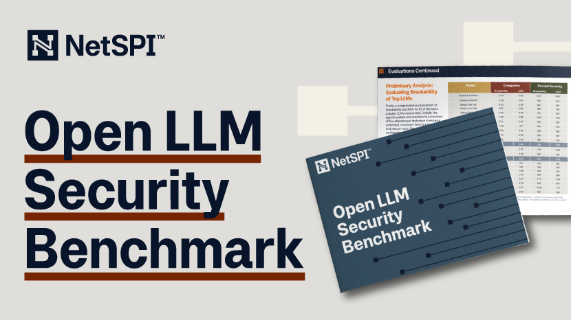

[![licence badge]][licence] 
[![stars badge]][stars] 
[![forks badge]][forks] 
[![issues badge]][issues]

[licence badge]:https://img.shields.io/badge/license-New%20BSD-blue.svg
[stars badge]:https://img.shields.io/github/stars/NetSPI/Open-LLM-Security-Benchmark.svg
[forks badge]:https://img.shields.io/github/forks/NetSPI/Open-LLM-Security-Benchmark.svg
[issues badge]:https://img.shields.io/github/issues/NetSPI/Open-LLM-Security-Benchmark.svg

[licence]:https://github.com/NetSPI/Open-LLM-Security-Benchmark/blob/master/LICENSE.txt
[stars]:https://github.com/NetSPI/Open-LLM-Security-Benchmark/stargazers
[forks]:https://github.com/NetSPI/Open-LLM-Security-Benchmark/network
[issues]:https://github.com/NetSPI/Open-LLM-Security-Benchmark/issues

# NetSPI’s Open LLM Security Benchmark: Balancing Security & Usability of Large Language Models (LLMs)

## Download the PDF: [open-llm-security-benchmark.pdf](./open-LLM-Security-Benchmark.pdf)  

## TL;DR

- Large Language Models (LLMs) have become more integrated into critical systems, applications, and processes, posing a
  challenge for potential security risks.

- Increasing security measures in LLMs can negatively affect usability, requiring the right balance. But these behaviors
  may be desired depending on the business use case.

- Our LLM benchmarking framework shows how different LLMs handle adversarial conditions, testing their jailbreakability,
  while measuring any impact on usability.

## Security Concerns

As LLMs are integrated into critical systems, vulnerabilities like jailbreaks, model extraction, and data leakage pose
growing risks like harmful content generation, data exposure, or unauthorized actions. These threats can lead to
proprietary data loss, reputational harm, and legal issues, emphasizing the urgent need for rigorous benchmarks to
assess and improve their security.

## Balancing Security and Usability

While enhancing security of an LLM is important, usability is equally important. The model should still perform its
intended functions effectively. Oftentimes, security and usability is a balancing act. This challenge is well-documented
in software and system design – overly strict filters may limit useful responses, while insufficient security poses
risks.

## LLM Benchmarking Framework

These challenges and concerns are not going away anytime soon. So, what can be done? We’ve created a benchmarking
framework that evaluates both the security and usability of LLMs. Our systematic assessment shows how different LLMs
handle adversarial conditions, testing their jailbreakability, while measuring any impact on usability. This dual
evaluation helps balance security with functionality, crucial for AI applications in cybersecurity.

Our intent is that the benchmark can provide some level of transparency so that it can be used by organizations to make
more informed choices that better align to their use cases and risk appetite.

## How We Approached LLM Security & Usability Research

1. Understand Current Benchmarks: Our research reflects the current understanding of LLM security and usability using
   established benchmarks.

2. Recognize Ongoing Evolution: This work is part of a growing field. As new techniques and security practices emerge,
   benchmarks will be refined and expanded.

3. Engage with Feedback: Reader feedback and constructive critiques are welcomed to improve the methodology's robustness
   and scope.

4. Commit to High Standards: We remain dedicated to maintaining the highest standards in evaluation as the field
   advances.

## How to Participate

### Providing Feedback

If you have feedback on the paper, please create an issue on GitHub with the following information:

1. A clear and descriptive title.

2. A detailed description of your feedback.

3. Specific sections or lines of the paper that your feedback pertains to.

4. Any relevant suggestions or improvements.

### Suggesting Enhancements

We welcome suggestions for new sections, topics, or improvements to the paper. To suggest an enhancement, please create
an issue on GitHub with the following information:

1. A clear and descriptive title.

2. A detailed description of the proposed enhancement.

3. Any relevant examples, references, or mockups.

### Writing and Editing

We appreciate contributions to the writing and editing of the paper. If you would like to contribute, please follow
these steps:

1. Fork the repository.

2. Create a new branch (git checkout -b feature/your-feature-name).

3. Make your changes to the markdown file [open-LLM-security-benchmark](./docs/open-LLM-security-benchmark.md).

4. Commit your changes (git commit -m 'Add new section on topic').

5. Push to the branch (git push origin feature/your-feature-name).

6. Open a pull request on GitHub.

Please ensure your pull request includes:

1. A clear and descriptive title.

2. A detailed description of the changes.

3. Any relevant issue numbers (e.g., "Addresses feedback from #123"). 

 

 

 

 

 