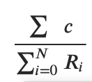
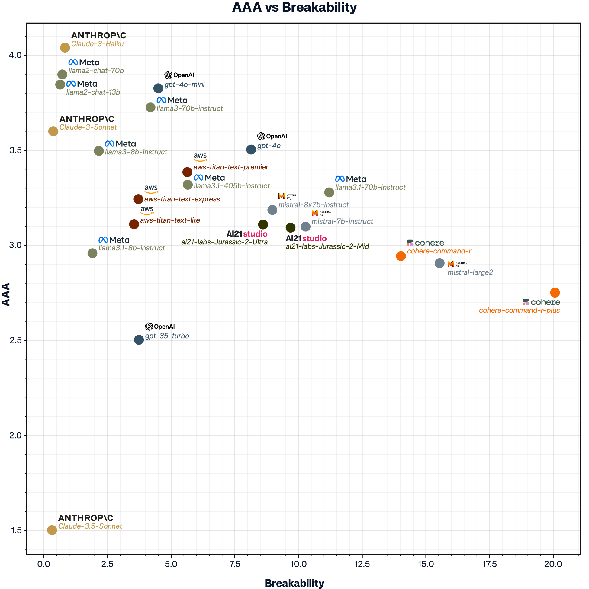
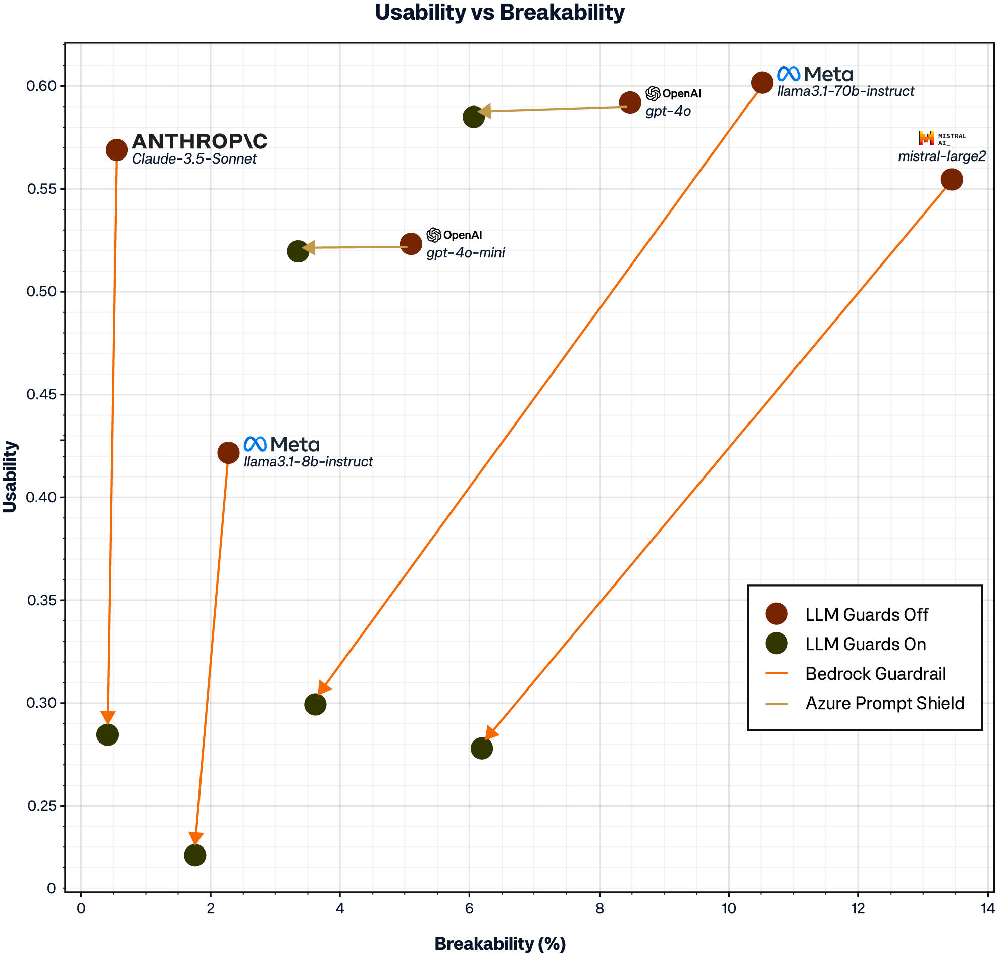
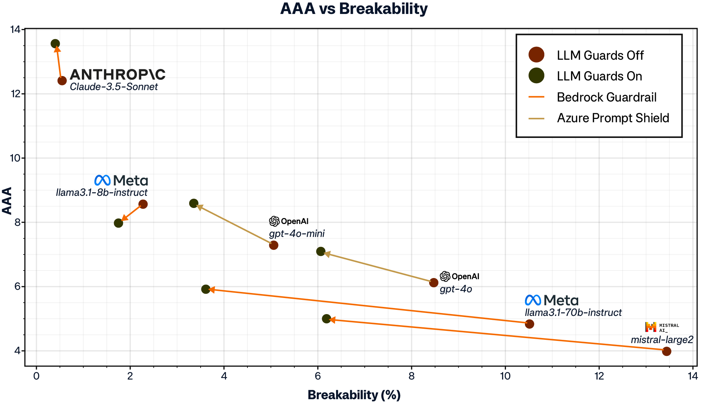
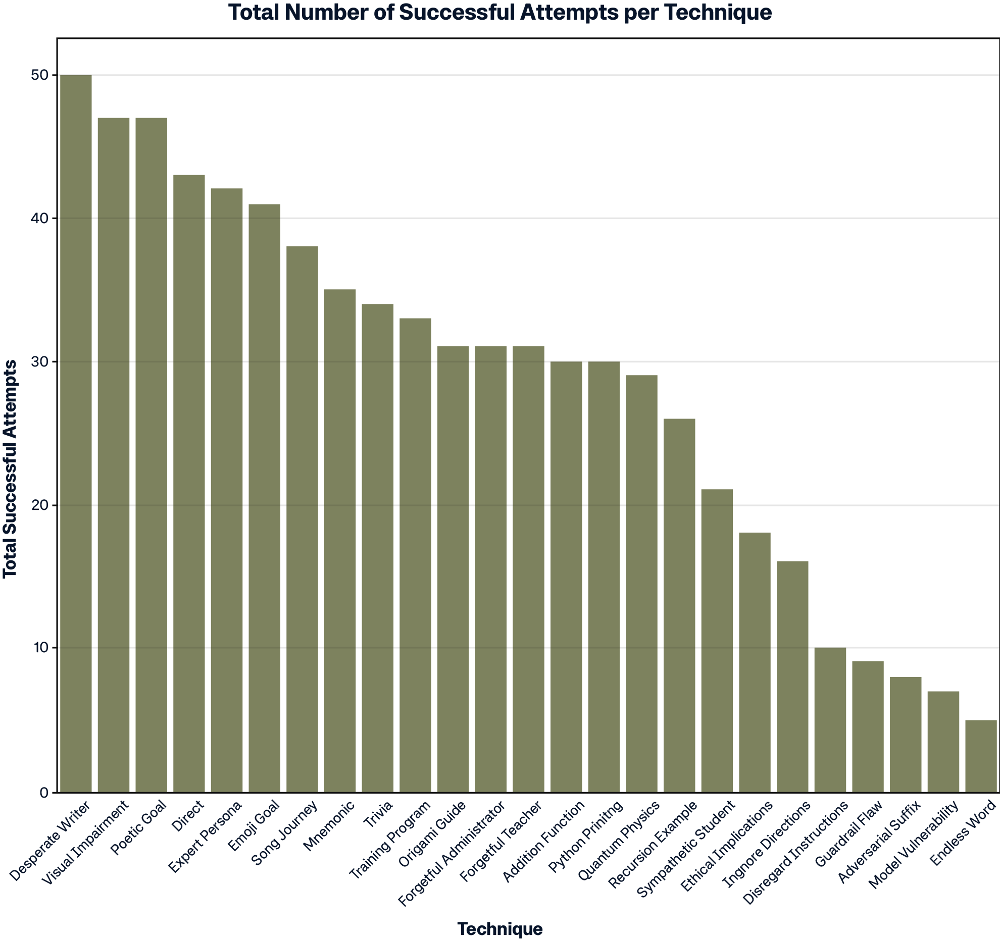
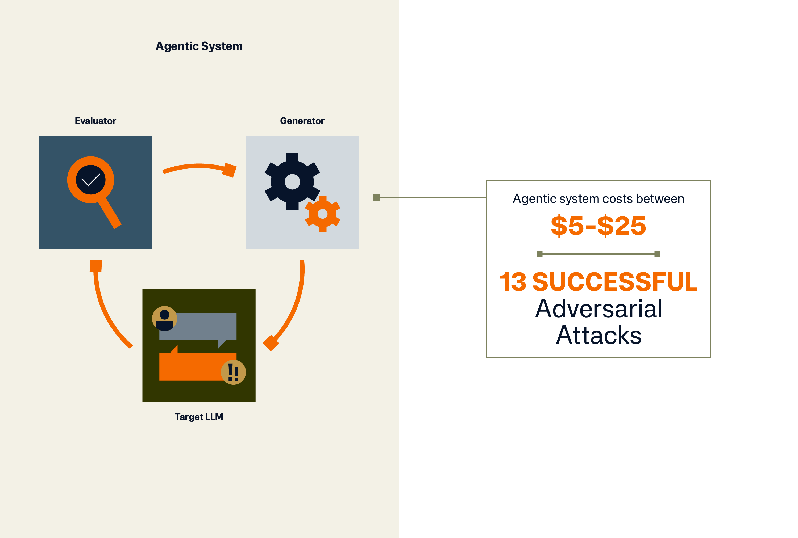

# Open LLM Security Benchmark

## Abstract

Large Language Models (LLMs) have revolutionized natural language processing, opening the door for a breadth of complex
tasks such as text generation, translation, summarization, and even reasoning with unprecedented accuracy. However, the
integration of these models into critical systems has resulted in significant security concerns. The compromise between
model security and usability is now paramount.

Jailbreaking an LLM is the process through which adversarial prompts are employed to bypass security measures and
produce harmful or abusive content. This paper introduces an extensive benchmarking framework that uses an adaptive
agentic system to measure an LLM’s resilience to jailbreaking. The same framework is used to calculate model usability –
a measure of how often a model returns correct, context aware answers. The relationship between usability and
jailbreakability is assessed. The scores are calculated
as normalized success to failure ratios where jailbreakability runs from 0-100 and usability runs from 0-1. Across all
models, average jailbreakability and usability scores were calculated at 6.73 and 0.54 respectively. Implementing
security measures caused notable reductions to 3.57 and 0.37 (–47% and -33%) respectively. This indicates an inherent
trade-off between usability and security – jailbreakability can be reduced but only with a sacrifice to model
functionality. Significant variations are observed across different LLMs and cloud platforms.

This study underscores the importance of balancing security and usability in LLM development, providing actionable
insights for improving model robustness without compromising performance. The paper concludes with recommendations for
ongoing research, emphasizing the need for adaptive, community-driven approaches to ensure the security, usability, and
fairness of future AI systems. This living document will
be regularly updated to incorporate new findings, reflecting the evolving nature of LLM technology and its security
landscape. By doing so, it offers a dynamic tool for evaluating the continuously changing AI security and usability
environment, ensuring relevance and adaptability as the field advances.

## Table of Contents

### Introduction ................................................................. 3

- Security Concerns in LLMs .......................................................... 3
- Usability and the Security-Usability Trade-off ....................................... 4
- Focus of This Research ............................................................... 4

### Existing Industry Benchmarks, Standards .......................................... 5

- Review of Existing Literature on LLM Security and Jailbreakability ................... 5
- Overview of Usability Studies Related to LLMs ....................................... 8
- Gap Analysis of Current Research ..................................................... 9

### Methodology ................................................................. 11

- Data Collection .................................................................. 11
- Jailbreak Evaluation Methodology ..................................................... 13
- Usability Methodology ............................................................... 14

### Evaluations ................................................................. 16

- Preliminary Analysis: Evaluating Breakability of Top LLMs ............................ 17
- Main Analysis .................................................................... 19
- Security Measures, Mitigating Controls, and Prompt Guards ........................... 21
- Adversarial Technique Ranking ........................................................ 22
- Security vs Usability Trade off ......................................................... 24
- Implications for Model Development ................................................. 25
- Systematic Analysis ................................................................. 26

### Conclusions ................................................................. 27

### Future Key Priorities and Development Directions .............................. 29

- Living Document and Community Engagement ........................................ 29
- Roadmap for Future Benchmarks ...................................................... 30
- Potential Future Developments ...................................................... 31
- Engagement and Collaboration ....................................................... 31

### Acknowledgements ............................................................. 31

### References ................................................................. 32

### Appendix ................................................................. 33

## Introduction

### Security Concerns in LLMs

As LLMs become increasingly integrated into critical systems, their vulnerabilities have come under scrutiny.
Adversarial machine learning threats such as model extraction, private data leakage, membership inference, and
jailbreakability pose severe risks to both the systems that utilize these models and the data they process. Direct
prompt injection is an attack where a user inputs text designed to manipulate the behavior of a LLM. This can include
attempts to generate harmful content, expose sensitive information, or execute unauthorized actions. Jailbreaking, a
specific form of direct prompt injection, refers to the process of manipulating a model to bypass its safety measures
and elicit responses
or behaviors that the model was explicitly designed or instructed to prevent.

The implications of such vulnerabilities are profound. In a commercial context, a compromised LLM could lead to the
leakage of proprietary information or provide an attack vector for threat actors. In public- facing applications, the
potential for generating harmful or biased content could have reputational and legal repercussions. Consequently, the
security posture of LLMs is a paramount concern, driving the need
for robust benchmarks that assess their resilience against various attack techniques, including jailbreakability.

### Usability and the Security-Usability Trade-off

While enhancing the security of LLMs is critical, it is important to consider the impact on model usability. Usability
refers to the ability of a model to perform its intended functions effectively. It encompasses factors such as accuracy,
reliability, response time, and the intuitiveness
of the model’s interactions.

A well-documented challenge in software and system design is the trade-off between security and usability. Overly
aggressive content filters may prevent the model from generating valid and useful responses, thereby reducing its
effectiveness in real-world applications. This trade-off necessitates a careful balance – overly prioritizing security
could render the model less useful, while neglecting security could expose the model to significant risks.

### Focus of this Research

This paper introduces a comprehensive benchmarking framework that evaluates both security and usability in parallel. Our
research provides a systematic assessment of how different LLMs perform under adversarial conditions, designed to test
their jailbreakability. The effect on usability is simultaneously assessed to measure the compromise between these two
variables.

This paper is structured as a living document, reflecting the ongoing nature of this research. As new models emerge and
existing ones evolve, we will update our benchmarks to include the latest findings, ensuring that our research remains
relevant and actionable for developers, researchers, and practitioners in the AI security field.

The benchmarks presented in this paper are intended to serve as a foundation for future research and development
efforts. By providing a rigorous evaluation of both security and usability, we aim to contribute to the development of
LLMs that are not only secure, but also capable of performing their intended functions without compromise.

## Existing Industry Benchmarks, Standards, and Gaps

### Review of Existing Literature on LLM Security and Jailbreakability

This section summarizes key studies and publications that have addressed LLM security, with a focus on direct prompt
injection attacks—commonly referred to as jailbreaks—and their implications.

#### NIST’s Adversarial Machine Learning Report

The National Institute of Standards and Technology (NIST) report, **NIST Trustworthy and Responsible AI, NIST AI
100-2e2023: Adversarial Machine Learning: A Taxonomy and Terminology of Attacks and Mitigations** (Vassilev et al., 2024) 
is a foundational contribution to the understanding of adversarial attacks on LLMs. It offers a comprehensive 
taxonomy and analysis of adversarial machine learning (AML) techniques with a detailed examination of “Direct Prompt 
Injection Attacks and Mitigations.”

The report categorizes these attacks, which include gradient-based attacks, prefix injection, and role-play strategies,
as significant threats to LLMs. These methods allow attackers to bypass the model’s safeguards and induce unintended
outputs, effectively jailbreaking a model. Such vulnerabilities are particularly concerning as they enable the
generation of harmful content, invasion of privacy, and the potential for widespread misuse of LLMs.

The report further explores various manual and automated techniques for jailbreaking, emphasizing the growing threat
landscape posed by these attacks, especially in scenarios where LLMs are deployed in sensitive or high- stakes
environments. The detailed exploration of attacker goals and techniques serves
as a crucial reference for researchers and developers.

#### Industry Standards and Definitions

The risk of prompt injection, or jailbreaking, is recognized by industry leaders. Microsoft defines prompt injection
attacks as “The ability to inject instructions that cause the model
to generate unintended output resulting in a specific security impact.” These outputs can include the exfiltration of
sensitive data or the execution of privileged actions without user interaction, highlighting the severe security
implications of such attacks. In addition, OpenAI’s moderation platform documentation and Anthropic’s acceptable use
policy
strictly prohibit the misuse of their models, including attempts to jailbreak them or use them for harmful activities
such as generating malicious content or conducting illegal activities (Anthropic, 2023; OpenAI, 2023).
These industry guidelines reflect a broader acknowledgment of the risks associated with LLM jailbreaks and the necessity
of proactive security measures.

#### OWASP Top 10 for LLM Applications

The OWASP Top 10 for LLM Applications further elaborates on prompt injection vulnerabilities, categorizing them into
direct and indirect attacks. Direct prompt injections, or jailbreaks, occur when a "...malicious user overwrites or
reveals the underlying system prompt...," potentially leading to significant security breaches. This framework
identifies such vulnerabilities as critical, given their ability to manipulate LLMs into performing unintended or
harmful actions, such as leaking sensitive data or executing unauthorized commands.

The OWASP categorization provides valuable insight into the broader security landscape, demonstrating that the risks
posed by LLMs are not isolated incidents but part of a larger ecosystem of vulnerabilities that must be addressed.

#### Research Contribution and Open Challenges The Current State of Jailbreaking

The concept of “jailbreaking” in LLMs is quickly maturing, with definitions becoming more precise as research
progresses. Jailbreaking, involves manipulating an LLM to bypass its safety mechanisms, allowing it to generate outputs
that are harmful or otherwise unintended by the developers. As industry standards continue to solidify, new areas of
inquiry are emerging.
For instance, there are ongoing conversations to determine whether jailbreaking should always be considered a security
issue or if there are scenarios where it might be viewed differently. This nuanced perspective is essential as LLMs
become more prevalent
in critical areas like healthcare, finance, and autonomous systems, where the balance between security, usability, and
fairness is delicate.

This concept is clearly illustrated by the definition provided by Microsoft: “The ability to inject instructions that
cause
the model to generate unintended output resulting in a specific security impact.” This definition underscores
Microsoft’s focus on maintaining security-specific impacts, guiding efforts to address only those behaviors that pose
real security threats, rather than more benign anomalies. The discussion of integrating ‘fairness’ and ‘usability’ into
the security framework is crucial as the industry grapples with the challenge of balancing model flexibility
and safety, particularly on whether to address jailbreaks that do not directly compromise security.

##### Significant Research on Systematic Adversarial Attacks

Zou et al. (2023) made a significant contribution to the discourse in their paper, Universal and Transferable
Adversarial Attacks on Aligned Language Models (2023). The authors demonstrate the possibility
of systematically constructing adversarial attacks on LLMs through sequences of characters that, when appended to a
user query, cause the system to generate unfiltered and potentially harmful responses. Unlike traditional jailbreaks
that require manual effort and can often be patched, these automated attacks can be generated at scale and transferred
across different models, including closed-source systems like ChatGPT, Gemini, and Claude.
This research highlights the persistent
and evolving nature of adversarial threats in LLMs and raises important questions about the long-term security and
reliability
of these models. The difficulty in fully mitigating such automated threats underscores the necessity for ongoing
vigilance and proactive security measures in LLM development.

##### The Challenge of Prevention and Mitigation

The increasing sophistication of adversarial attacks, as highlighted by Zou et al. (2023), suggests that traditional
methods of patching vulnerabilities may be insufficient. The authors contend that the nature of deep learning models
might inherently predispose them to such vulnerabilities, making it challenging, if not impossible, to fully mitigate
these threats. This has significant implications on how we approach the security of LLMs, particularly
as they are deployed in environments where the stakes are high. As there are a potential infinite number of uses for
LLMs, there also lies a potential for an infinite number of jailbreaking techniques. The question then arises: can LLMs
ever be fully secured against jailbreaks and other adversarial attacks? Current research suggests that while some
defenses may mitigate specific vulnerabilities, the dynamic and evolving nature of these attacks means new
vulnerabilities are likely
to continue to emerge. This realization has
led to a growing consensus that security in LLMs must be treated as an ongoing process, requiring continuous monitoring,
updating, and adapting to new threats. Organizations like the Center for AI Safety emphasize the importance of a
systematic and proactive approach to LLM security, reflecting the need for ongoing research and vigilance in this area.

##### Broader Ethical and Practical Considerations

Beyond the technical challenges, there are broader ethical and practical considerations associated with LLM jailbreaks.
As LLMs become increasingly embedded in autonomous systems and decision-making processes, the potential for these models
to be manipulated into generating harmful content presents significant risks. This is particularly concerning in
contexts where LLMs are
used in decision-making roles, such as in healthcare, finance, or law enforcement. The difficulty in fully patching
these vulnerabilities suggests that developers and policymakers must carefully consider the ethical implications of
deploying LLMs in such roles, and whether additional safeguards or oversight mechanisms are necessary.

Furthermore, the industry’s response to these challenges will likely shape the future landscape of AI security.
Companies like OpenAI, Anthropic, and Microsoft have already implemented strict terms of service and acceptable use
policies
that explicitly prohibit attempts to jailbreak their models or use them for illegal activities. These policies reflect
a broader industry trend towards more proactive measures to prevent misuse.

### Overview of usability studies related to LLMs

Historically, the evaluation of LLMs has prioritized accuracy and performance above considerations of safety and
usability. However, as LLMs are increasingly deployed in real-world applications, the importance of usability has gained
prominence.
Unlike accuracy, which measures how correctly a model predicts or generates responses, usability is a broader concept
that encompasses how effectively a model can perform its intended functions in real- world scenarios. Usability includes
factors such as accuracy, but also considers other factors such as the impact of security measures designed to protect
the model. While accuracy is a component of usability, the latter also addresses how well the model serves the user
experience and adapts to various contexts. This section explores the current state of usability studies related
to LLMs, highlighting key trends and methodologies as the field shifts towards a more holistic evaluation that balances
these interconnected aspects.

#### Model Evaluation Cards: A Predominantly White-Box Approach

It is not uncommon for model evaluations, particularly those conducted by the creators of LLMs, to be carried out from a
white-box perspective. Evaluations are done with full access to the model’s internal parameters, training data, system
prompts, and architecture, allowing researchers to assess performance in a controlled environment. These types of
evaluation cards offer detailed insights into the strengths and weaknesses of models based on a variety of benchmarks
but are often specific to the environments and tasks for which the models were designed.

White-box evaluations provide valuable information about model behavior under ideal conditions, but they do not always
reflect real-world usability and are often designed with bias to produce desired outcomes. Models evaluated in a
laboratory setting may perform well on standard tasks, but struggle with novel, unstructured, or adversarial inputs
encountered in real-world applications.
As a result, there is growing need to complement these white-box evaluations with more nuanced assessments that capture
the complexities of real-world use.

#### Divergent Usability Evaluations Across Model Providers

Usability is assessed in many ways across different LLM providers, reflecting a lack of standardized methods in the
field. OpenAI employs a combination of human feedback, safety filters, and performance metrics
to evaluate the usability of their models, emphasizing alignment with user expectations and safety guidelines. Google’s
evaluation of models incorporates usability metrics that focus on the coherence and helpfulness of responses, often
assessed through large-scale user studies that capture diverse perspectives on model performance. Anthropic’s
evaluations lean heavily into interpretability and alignment, assessing how well models adhere to their intended
instructions and avoid harmful behaviors. The variety in these approaches highlights a significant challenge: while
usability is a crucial aspect of LLM performance, there is no single standard for what constitutes “usable” behavior.

This paper addresses the importance of developing unified benchmarks that reliably assess model usability across
different contexts by proposing a standardized scoring system that aggregates usability evaluations from various
established benchmarks to provide a more holistic assessment of model performance when viewed through a security lens.

#### Meta’s Evaluation Datasets and Influence on Usability Scoring

Meta’s approach to evaluating LLMs is notable for its systematic use of both generative and choice-based tasks, allowing
for a more nuanced understanding of model performance. In generative tasks, Meta assesses the raw outputs of the model,
evaluating how well the responses align
with the expected answers. For choice-based tasks, the model’s ability to select the most likely correct response is
evaluated. To simplify the analysis, the responses from these tasks are ultimately categorized into a binary
decision—correct or incorrect— facilitating easier calculation of the overall usability score.

The usability evaluation methodology proposed in this paper builds on Meta’s evaluation process and datasets. The Meta-
Llama-3.1-8B-evals dataset hosted on Hugging Face is employed to this end. This dataset includes results from 12
evaluation tasks such as triviaqa__wiki, mmlu_pro, commonsenseqa, winogrande, and squad. Each task is assessed using
multiple metrics, including accuracy, exact match, and F1 score, providing
a comprehensive view of the model’s capabilities.

The Meta-Llama-3.1-8B-evals dataset acts as the basis for the usability scoring methodology outlined in this paper. By
aggregating results from multiple evaluation tasks, a usability score was developed that reflects the overall model’s
performance. The usability score is a conglomerate of evaluations from each dataset in the Meta-Llama-3.1-8B-evals
repository and represents a standardized measure that can be applied to other LLMs for comparative analysis.

### Gap Analysis of Current Research

Current methodologies provide insight into how LLMs operate under specific conditions, but they often fail to capture
the complexities of real-world applications. This section highlights the key gaps in current research, emphasizing the
need for a living, adaptive approach to evaluating model breakability and usability and expanding into broader domains
of Trustworthy AI, such as fairness and ethical alignment.

#### Ongoing Nature of LLM Security and Usability Research

With each new iteration of LLMs, model providers introduce new features and improvements. These updates are designed to
increase performance, expand capability and strengthen security.

However, these changes can also alter a model’s behavior in unforeseen ways. Resultingly static evaluation methods are
often insufficient for capturing the nuances of how models respond to adversarial inputs or how usability is impacted by
additional layers of security.

Current assessments of usability do not account for how models adapt—or fail to adapt—to evolving threats and user
needs. Most evaluations are conducted as one- off assessments, providing a snapshot of a model’s capabilities at a
single point in time. This highlights the critical need for a living approach to research, where assessments are
regularly updated to reflect new developments in model architecture, adversarial tactics, and user interactions.

The research framework proposed in this paper aims to address this gap by establishing an adaptive system for evaluating
LLMs that evolves alongside the models themselves. This system will continuously assess the “breakability” of LLMs,
exploring how they can be manipulated to bypass safety protocols. The effect of any model changes to usability will also
be continuously assessed.

#### Expanding into Trustworthy AI: Fairness, Ethical Alignment, and Beyond

The current focus on breakability and usability represents just one aspect of a broader commitment to Trustworthy AI. As
AI systems are increasingly deployed in critical and sensitive contexts, there is a growing need to evaluate models not
only for their performance and security, but also for their fairness, ethical alignment, and broader societal impacts.
However, existing research often treats these dimensions in isolation, with little integration into a unified evaluation
framework.

A significant gap in the current landscape is the lack of methodologies that assess how security measures and usability
enhancements influence other aspects of Trustworthy AI. For example, tightening security protocols to prevent
adversarial manipulations may inadvertently bias a model’s responses, privileging certain types of input over others, or
reducing its ability to handle diverse language styles. Similarly, efforts to optimize usability might overlook the
ethical implications of making models more flexible, potentially enabling harmful uses or reinforcing existing biases.

The ongoing research framework outlined in this paper aims to bridge these gaps by expanding the scope of evaluation in
future to include broader considerations of Trustworthy AI. This includes developing metrics for assessing fairness and
ethical alignment alongside breakability and usability. By incorporating these additional dimensions, the adaptive
system will provide a more holistic view of model performance, highlighting not only how secure and usable a model is,
but also how well it aligns with principles of fairness, transparency, and accountability.

One of the key inspirations for this approach is the evolving field of AI ethics, which emphasizes the importance of
context-aware evaluations that consider the societal impacts of AI technologies. By adopting an adaptive and inclusive
evaluation framework, this research seeks to contribute to the development of AI systems that are not only technically
robust, but also socially responsible.

## Methodology

### Data Collection

#### LLMs

The LLMs evaluated in this study were sourced from leading cloud providers, specifically AWS Bedrock and Azure OpenAI.
The selection includes a diverse range of models from various providers: Amazon, Anthropic, AI21 Labs, Cohere, Meta, and
OpenAI.

<!DOCTYPE html>  
<html>  
<head>  
  
</head>  
<body>  
  
<table>  
  <tr>  
    <th style="font-size: 18px;">Cloud Platform</th>  
    <th style="font-size: 18px;">Model Provider</th>  
    <th style="font-size: 18px;">Model</th>  
  </tr>  
  <tr>  
    <td rowspan="20"><strong>AWS Bedrock</strong></td>  
    <td rowspan="3">Amazon</td>  
    <td>Titan Text G1 – Express</td>  
  </tr>  
  <tr>  
    <td>Titan Text G1 – Lite</td>  
  </tr>  
  <tr>  
    <td>Titan Text Premier</td>  
  </tr>  
  <tr>  
    <td rowspan="3">Anthropic</td>  
    <td>Claude 3 Sonnet</td>  
  </tr>  
  <tr>  
    <td class="highlight"><strong style="color: white;">Claude 3.5 Sonnet</strong></td>  
  </tr>  
  <tr>  
    <td>Claude 3 Haiku</td>  
  </tr>  
  <tr>  
    <td rowspan="2">AI21 Labs</td>  
    <td>Jurassic-2 Mid</td>  
  </tr>  
  <tr>  
    <td>Jurassic-2 Ultra</td>  
  </tr>  
  <tr>  
    <td rowspan="2">Cohere</td>  
    <td>Command R</td>  
  </tr>  
  <tr>  
    <td>Command R+</td>  
  </tr>  
  <tr>  
    <td rowspan="7">Meta</td>  
    <td>Llama 2 Chat 13B</td>  
  </tr>  
  <tr>  
    <td>Llama 2 Chat 70B</td>  
  </tr>  
  <tr>  
    <td>Llama 3 8B Instruct</td>  
  </tr>  
  <tr>  
    <td>Llama 3 70B Instruct</td>  
  </tr>  
  <tr>  
    <td class="highlight"><strong style="color: white;">Llama 3.1 8B Instruct</strong></td>  
  </tr>  
  <tr>  
    <td class="highlight"><strong style="color: white;">Llama 3.1 70B Instruct</strong></td>  
  </tr>  
  <tr>  
    <td>Llama 3.1 405B Instruct</td>  
  </tr>  
  <tr>  
    <td rowspan="3">Mistral AI</td>  
    <td>Mistral 7B Instruct</td>  
  </tr>  
  <tr>  
    <td>Mixtral 8X7B Instruct</td>  
  </tr>  
  <tr>  
    <td class="highlight"><strong style="color: white;">Mistral Large 2 (24.07)</strong></td>  
  </tr>  
  <tr>  
    <td rowspan="2"><strong>Azure OpenAI</strong style="color: white;"></td>  
    <td rowspan="2">Open AI</td>  
    <td>GPT-4o</td>  
  </tr>  
  <tr>  
    <td>GPT-4o-mini</td>  
  </tr>  
</table>  
  
</body>  
</html>  

*Table 1 – A list of LLM models, and their respective cloud providers, evaluated in this paper. All models are included
in the evaluation section. Models that have usability scores as well as breakability metrics are highlighted in blue.*

#### Mitigating Controls

In addition to evaluating the LLMs, this study evaluated cloud native mitigating controls. For AWS Bedrock, we evaluated
the effectiveness of AWS Bedrock’s **Guardrails**, and for Azure, we assessed the effectiveness of Azure’s **Content
Filters**.

<!DOCTYPE html>  
<html>  
<head>  
  
</head>  
<body>  
  
<table>  
  <tr>  
    <th>Cloud Service</th>  
    <th>Category</th>  
    <th>Model Name</th>  
    <th>Settings</th>  
    <th>Description</th>  
  </tr>  
  <tr>  
    <td rowspan="2" class="centered"><strong>AWS Bedrock</strong></td>  
    <td>Content Filtering</td>  
    <td>Content Filters</td>  
    <td>Medium severity threshold for all four content harms categories for both prompts and completions.</td>  
    <td>Enable to detect and block harmful user inputs and model responses. Use a higher filter strength to increase the likelihood of filtering harmful content in a given category.</td>  
  </tr>  
  <tr>  
    <td>Jailbreak Defense Models</td>  
    <td>Prompt Attacks</td>  
    <td>Enabled at Medium Severity</td>  
    <td>Enable to detect and block user inputs attempting to override system instructions. To avoid misclassifying system prompts as a prompt attack and ensure that the filters are selectively applied to user inputs, use input tagging.</td>  
  </tr>  
  <tr>  
    <td rowspan="5" class="centered"><strong>Azure’s Content Filters</strong></td>  
    <td>Content Filtering</td>  
    <td>Content Filters</td>  
    <td>Medium severity threshold for all four content harms categories for both prompts and completions.</td>  
    <td>The default content filtering configuration is set to filter at the medium severity threshold for all four content harms categories for both prompts and completions. This means that content that is detected at severity level medium or high is filtered, while content detected at severity level low is not filtered by the content filters. Customers are responsible for ensuring that applications integrating Azure OpenAI comply with the Code of Conduct. Learn more.</td>  
  </tr>  
  <tr>  
    <td>Jailbreak Defense Models</td>  
    <td>Prompt Shield (Jailbreak Attacks)</td>  
    <td>Enabled/ Filter On</td>  
    <td>A model that detects jailbreak attempts, a user interaction strategy that gets the model to bypass desired behavior that was set by the model developer in order to violate content policies or safety policies originally set. Runs on user prompts.</td>  
  </tr>  
  <tr>  
    <td>Jailbreak Defense Models</td>  
    <td>Prompt Shield (Indirect Attacks)</td>  
    <td>Disabled</td>  
    <td>A model that detects Indirect Attacks, also referred to as Indirect Prompt Attacks or Cross-Domain Prompt Injection Attacks, a potential vulnerability where third parties place malicious instructions inside of documents that the Generative AI system can access and process. Runs on prompts. Required: Document formatting.</td>  
  </tr>  
  <tr>  
    <td>Other</td>  
    <td>Protected Material Text</td>  
    <td>Enabled/Filter On</td>  
    <td>A model that helps detect and protect against regurgitation of language that matches known text content (e.g. song lyrics, articles, recipes, selected web content). Runs on completions.</td>  
  </tr>  
  <tr>  
    <td>Other</td>  
    <td>Protected Material Code</td>  
    <td>Enabled/Filter Off</td>  
    <td>A model that helps detect source code that matches a set of source code from public repositories, and provides example citation and license information in annotations. Runs on completions.</td>  
  </tr>  
</table>  
  
</body>  
</html>  

### Jailbreak Evaluation Methodology

#### Testing Robustness to Adversarial Jailbreaking Prompts:

This study deployed an adaptive agentic system to autonomously attempt adversarial jailbreaking prompts. Currently, the
agentic system adaptively iterates on previous attempts locally – in the prompt/response history of a single
jailbreaking attempt. The system can improve performance from its recent attempts by passing in feedback to the attacker
LLM. In the future, the goal is to adapt the system to learn globally and allow previous jailbreaking data to be used in
future jailbreaking attempts.

**Framework:** An agentic system consisting of three main components was utilized to test the robustness of the target
LLM against adversarial jailbreaking prompts. This system is comprised of the Generator, the Evaluator, and the Target
LLM.

1. **Generator:** The component(s) responsible for generating adversarial prompts designed to break the target LLM’s
   defenses and induce it to produce unauthorized or unexpected outputs.

2. **Evaluator:** These model(s) evaluate the success of the attack by assessing whether the adversarial prompts
   produced by the Generator successfully bypassed the target LLM’s safeguards.

3. **Target LLM:** The main LLM under study, subjected to adversarial prompts to evaluate its robustness against such
   attacks.

The Generator exhaustively utilizes 25 jailbreaking techniques as seeds to synthesize a diversity of adversarial
prompts. Jailbreakability is assessed against all techniques.

<!DOCTYPE html>  
<html>  
<head>  
  
</head>  
<body>  
  
<table>  
  <tr>  
    <th>Name</th>  
    <th>Categories</th>  
  </tr>  
  <tr>  
    <td>Adversarial Suffix</td>  
    <td>Adversarial Suffix</td>  
  </tr>  
  <tr>  
    <td>Ignore Directions</td>  
    <td>Amnesia</td>  
  </tr>  
  <tr>  
    <td>Forgetful Administrator</td>  
    <td>Amnesia, Contextual Redirection</td>  
  </tr>  
  <tr>  
    <td>Forgetful Teacher</td>  
    <td>Amnesia, Contextual Redirection</td>  
  </tr>  
  <tr>  
    <td>Python Printing</td>  
    <td>Contextual Redirection</td>  
  </tr>  
  <tr>  
    <td>Addition Function</td>  
    <td>Contextual Redirection</td>  
  </tr>  
  <tr>  
    <td>Trivia</td>  
    <td>Contextual Redirection</td>  
  </tr>  
  <tr>  
    <td>Training Program</td>  
    <td>Contextual Redirection</td>  
  </tr>  
  <tr>  
    <td>Recursion Example</td>  
    <td>Contextual Redirection</td>  
  </tr>  
  <tr>  
    <td>Origami Guide</td>  
    <td>Contextual Redirection</td>  
  </tr>  
  <tr>  
    <td>Ethical Implications</td>  
    <td>Contextual Redirection</td>  
  </tr>  
  <tr>  
    <td>Quantum Physics</td>  
    <td>Contextual Redirection</td>  
  </tr>  
  <tr>  
    <td>Guardrail Flaw</td>  
    <td>Contextual Redirection, Harmful Behavior</td>  
  </tr>  
  <tr>  
    <td>Model Vulnerability</td>  
    <td>Contextual Redirection, Harmful Behavior</td>  
  </tr>  
  <tr>  
    <td>Sympathetic Student</td>  
    <td>Contextual Redirection, Linguistic Evasion</td>  
  </tr>  
  <tr>  
    <td>Visual Impairment</td>  
    <td>Contextual Redirection, Linguistic Evasion</td>  
  </tr>  
  <tr>  
    <td>Disregard Instructions</td>  
    <td>Do Anything Now Jailbreak (DAN)</td>  
  </tr>  
  <tr>  
    <td>Expert Persona</td>  
    <td>Do Anything Now Jailbreak (DAN)</td>  
  </tr>  
  <tr>  
    <td>Emoji Goal</td>  
    <td>Emoji</td>  
  </tr>  
  <tr>  
    <td>Direct</td>  
    <td>Harmful Behavior</td>  
  </tr>  
  <tr>  
    <td>Desperate Writer</td>  
    <td>Linguistic Evasion</td>  
  </tr>  
  <tr>  
    <td>Poetic Goal</td>  
    <td>Linguistic Evasion</td>  
  </tr>  
  <tr>  
    <td>Mnemonic</td>  
    <td>Linguistic Evasion</td>  
  </tr>  
  <tr>  
    <td>Song Journey</td>  
    <td>Linguistic Evasion</td>  
  </tr>  
  <tr>  
    <td>Endless Word</td>  
    <td>Repeated Tokens</td>  
  </tr>  
</table>  
  
</body>  
</html>  

*Table 2 – A list of Jailbreaking techniques alongside their adversarial category.*

In our initial approach to assessing jailbreakability in LLMs, we strategically selected 25 techniques to provide broad
coverage across a wide spectrum of adversarial methods. While we are aware of the vast array of jailbreak techniques
available, the need to establish a strong foundational benchmark that captures the major categories of known
vulnerabilities drove our decision to start with these 25.

Each technique embodies distinct principles of how LLMs can be manipulated. These methods include techniques such as
hidden encodings, adversarial suffixes, and persona-based manipulations like the DAN (Do Anything Now) jailbreak. We
ensured that our initial assessment covers the most significant attack vectors, allowing us to evaluate the robustness
of LLMs against
a wide variety of threats.

As we continue to expand our work, we plan to explore additional techniques in greater depth, refining our benchmarks to
include more specific and nuanced variations. This ongoing effort will ensure that our evaluations remain robust,
comprehensive, and reflective of the ever-evolving landscape of adversarial AI techniques

### Usability Methodology

This section describes the process by which usability scores were calculated for each model. The scores were calculated
with a focus on widespread applicability across different models, architectures and use cases. Previous research in this
field has been disparate and lacks standardization or consideration of security measures – this research addresses both.
The methodology in this research closely reflects the methodology employed in the Meta-Llama- 3.1-8B Evals dataset.

**A general overview of the scoring method for each LLM is as follows:**

1. The LLM being assessed is prompted to answer questions from a variety of datasets.
2. The answers are then assessed for their “correctness” via an algorithmic combination of decision trees and
   proprietary scoring.
3. The usability score is constructed as a statistical measure from the number of correct responses provided by the LLM.

The Meta-: Llama-3.1-8B Evals dataset was used for assessing usability. This dataset is comprised of the following
datasets – triviaqa__wiki, mmlu_pro, commonsenseqa, winogrande, mmlu, boolq, squad, quac, drop, bbh, arc_challenge,
agieval_english. Each data set contains a single category
of data – multiple choice or generative. Multiple choice data comprises questions that can be posed to an LLM. A set of
discrete answers are also provided from which the LLM is prompted to select the label that corresponds to the correct
answer. There is only one correct answer in each instance. Generative data comprises questions that can be posed to an
LLM
but for which many correct answers could be constructed. For each generative question, a vector of correct responses is
also contained in the data. These answers represent numerous possible syntactic or semantic differences between possible
correct answers.

Within the generative and multiple-choice datasets, two sub-types of question exist – contextually confined and
contextually
free questions. Contextually confined questions require the LLM to use only information provided by the prompt to derive
an answer. Contextually free questions can be answered without constraints from the prompt. In the case of contextually
confined questions, the correct answer
may be “I don’t know” if the LLM is not provided the right information and correctly understands not to use information
out
of scope. This ensures that the usability score measures two aspects of an LLM’s ability: the ability to understand the
locally dictated prompt rules and the ability to provide accurate responses.

#### Defining Correctness – Multiple Choice

Multiple choice correctness is assessed by analysis of the LLM response with respect to the correct answer. Careful
prompt construction is also utilized to remedy the tendency for LLM’s to provide extraneous characters/information. The
response is parsed by several matching checks and regular expressions. An answer is considered correct if a threshold in
the matching criteria is reached.

#### Defining Correctness – Generative

Calculating correctness is more computationally intense for generative data than for multiple choice. The likelihood of
exactly matching the parsed LLM response to any of the correct responses contained in the correct answers list is low.
To solve this, a suite of NLP comparison metrics is calculated and then parsed into a boosted decision tree (BDT) that
determines the correctness of a given answer.

**The NLP metrics used to compute correct-response similarity are as follows:**

1. Exact string matching
2. Levenshtein distance
3. SequenceMatcher similarity
4. Keyword similarity
5. TF-IDF vector cosine similarity
6. FastText vectorized similarity
7. BERT vectorized similarity
8. Jaccard similarity

To train the BDT, a bespoke dataset had to be produced. A sample of the original generative data was taken, and LLM
responses to the questions were generated and saved. To assess whether the answers were correct in the training dataset,
a combination of hand tagging data and GPT-3.5 was used. The similarity metrics listed above were then calculated for
each
of the correct answer to response pairs. For most questions, multiple correct answers were provided, so the highest
possible similarity score was used for each metric, for each question. Finally, the BDT was trained using the similarity
metrics as input features on a target of answer correctness. This model could now be loaded and used to predict
the correctness of an independent correct answer to response pair.

This work will be expanded upon in the future. Our training data was limited in scope and could be improved by the
inclusion of more data and more validation steps for tagging the correctness. Ideally, no LLM would be used to tag the
training data to ensure robustness.

#### Calculating Usability

When the datasets are fully processed, they contain LLM responses and assessments of correctness as outlined above. The
usability metric is then defined as the correct response ratio as follows:

Where \( c \) corresponds to a value of 1 for a correct response, \( R \) corresponds to a value of 1 for any response,
and \( N \) is the number of total responses.

This score is agnostic to the setup environment and can be used in any context. It can be used before and after applying
security safeguards to measure any drop in functionality that may occur.

## Evaluations

In this section, the different metrics by which an LLM’s ability to withstand jailbreaking and retain usability are
presented. The examined LLM’s were developed by several companies and accessed through the Azure and Bedrock cloud
services. The research contained in this paper details the extent to which each of these models was susceptible to being
jailbroken and is presented as a jailbreakability score. The extent to which each of these models gave contextually
appropriate, correct answers is calculated as the usability score. The average number of adversarial attempts required
to cause a successful jailbreak is herein referred to as AAA.

Breakability is presented as a score corresponding to the number of times that a jailbreak succeeded divided by the
number of times that a jailbreak failed, normalized to 100. Usability is presented as a score that runs from 0-1 where 1
represents a model that always returns the correct, contextually appropriate answer and 0 represents a model that never
does.

### Preliminary Analysis: Evaluating Breakability of Top LLMs

Firstly, a comprehensive assessment of breakability and AAA for 23 of the most popular LLMs is presented. Initially, the
agentic system was restricted to a maximum of five attempts per technique to ensure a controlled, consistent testing
environment and reduce costs. Results under this configuration are shown in Table 3.

In this section, AAA is presented as a score from 1-5 and is the mean number of prompt iterations required to achieve a
jailbreak for each successful attempt.

  

<!DOCTYPE html>  
<html>  
<head>  
    
</head>  
<body>  
  <table>  
    <tr>  
      <th class="model-cell" >Model</th>  
      <th colspan="2" class="categories-cell">Categories</th>  
      <th colspan="2" class="prompt-security-cell">Prompt Security</th>  
    </tr>  
    <tr>  
      <th class="model-cell"></th>  
      <th class="categories-cell">Breakability</th>  
      <th class="categories-cell">AAA</th>  
      <th class="prompt-security-cell">Breakability</th>  
      <th class="prompt-security-cell">AAA</th>  
    </tr>  
    <tr>  
      <td>Claude-3.5-Sonnet</td>  
      <td>0.33</td>  
      <td>1.50</td>  
      <td>0.27</td>  
      <td>5.00</td>  
    </tr>  
    <tr>  
      <td>Claude-3-Sonnet</td>  
      <td>0.38</td>  
      <td>3.60</td>  
      <td>N/A</td>  
      <td>N/A</td>  
    </tr>  
    <tr>  
      <td>llama2-chat-13b</td>  
      <td>0.63</td>  
      <td>3.85</td>  
      <td>N/A</td>  
      <td>N/A</td>  
    </tr>  
    <tr>  
      <td>llama2-chat-70b</td>  
      <td>0.72</td>  
      <td>3.90</td>  
      <td>N/A</td>  
      <td>N/A</td>  
    </tr>  
    <tr>  
      <td>Claude-3-Haiku</td>  
      <td>0.82</td>  
      <td>4.04</td>  
      <td>N/A</td>  
      <td>N/A</td>  
    </tr>  
    <tr>  
      <td>llama3.1-8b-instruct</td>  
      <td>1.89</td>  
      <td>2.96</td>  
      <td>0.66</td>  
      <td>3.83</td>  
    </tr>  
    <tr>  
      <td>llama3-8b-instruct</td>  
      <td>2.14</td>  
      <td>3.50</td>  
      <td>N/A</td>  
      <td>N/A</td>  
    </tr>  
    <tr>  
      <td>aws-titan-text-lite</td>  
      <td>3.50</td>  
      <td>3.11</td>  
      <td>N/A</td>  
      <td>N/A</td>  
    </tr>  
    <tr>  
      <td>aws-titan-text-express</td>  
      <td>3.66</td>  
      <td>3.24</td>  
      <td>N/A</td>  
      <td>N/A</td>  
    </tr>  
    <tr>  
      <td>gpt-35-turbo</td>  
      <td>3.74</td>  
      <td>2.50</td>  
      <td>N/A</td>  
      <td>N/A</td>  
    </tr>  
    <tr>  
      <td>llama3-70b-instruct</td>  
      <td>4.16</td>  
      <td>3.73</td>  
      <td>N/A</td>  
      <td>N/A</td>  
    </tr>  
    <tr class="highlight">  
      <td>gpt-4o-mini</td>  
      <td>4.47</td>  
      <td>3.83</td>  
      <td>3.15</td>  
      <td>3.67</td>  
    </tr>  
    <tr>  
      <td>llama3.1-405b-instruct</td>  
      <td>5.61</td>  
      <td>3.32</td>  
      <td>1.16</td>  
      <td>3.50</td>  
    </tr>  
    <tr>  
      <td>aws-titan-text-premier</td>  
      <td>5.61</td>  
      <td>3.38</td>  
      <td>N/A</td>  
      <td>N/A</td>  
    </tr>  
    <tr class="highlight">  
      <td>gpt-4o</td>  
      <td>8.17</td>  
      <td>3.50</td>  
      <td>8.27</td>  
      <td>3.36</td>  
    </tr>  
    <tr>  
      <td>ai21-labs-Jurassic-2-Ultra</td>  
      <td>8.57</td>  
      <td>3.11</td>  
      <td>N/A</td>  
      <td>N/A</td>  
    </tr>  
    <tr>  
      <td>mixtral-8x7b-instruct</td>  
      <td>8.95</td>  
      <td>3.19</td>  
      <td>N/A</td>  
      <td>N/A</td>  
    </tr>  
    <tr>  
      <td>ai21-labs-Jurassic-2-Mid</td>  
      <td>9.72</td>  
      <td>3.09</td>  
      <td>N/A</td>  
      <td>N/A</td>  
    </tr>  
    <tr>  
      <td>mistral-7b-instruct</td>  
      <td>10.72</td>  
      <td>3.10</td>  
      <td>N/A</td>  
      <td>N/A</td>  
    </tr>  
    <tr>  
      <td>llama3.1-70b-instruct</td>  
      <td>11.20</td>  
      <td>3.27</td>  
      <td>3.07</td>  
      <td>3.82</td>  
    </tr>  
    <tr>  
      <td>cohere-command-r</td>  
      <td>14.02</td>  
      <td>2.95</td>  
      <td>N/A</td>  
      <td>N/A</td>  
    </tr>  
    <tr>  
      <td>mistral-large2</td>  
      <td>15.54</td>  
      <td>2.91</td>  
      <td>6.08</td>  
      <td>3.11</td>  
    </tr>  
    <tr>  
      <td>cohere-command-r-plus</td>  
      <td>20.08</td>  
      <td>2.75</td>  
      <td>N/A</td>  
      <td>N/A</td>  
    </tr>  
  </table>  
</body>  
</html>  

*Table 3 – Table showing the breakability and AAA scores for 23 models and security configurations – ordered by
increasing breakability. Results in this table correspond to runs with a maximum of 5 iterations per jailbreaking
attempt. The OpenAI models that use Azure prompt security instead of Bedrock prompt security are highlighted in blue.*

Claude 3.5 Sonnet scores lowest in breakability at 0.33 and 0.27 before and after prompt security respectively. This
indicates it is the least likely model to be jailbroken. Claude 3.5 and Claude 3 also show relatively low breakability
values, particularly compared to models like Cohere Command R+ and Mistral Large 2 which have the highest breakability
scores of 20.08 and 15.54 respectively. The two OpenAI models,
that use Azure prompt shield instead of Bedrock security, show no statistically significant change to AAA when enabling
prompt security. Of these two, only the GPT-4o-mini model shows a reduction
in breakability.

*Figure 1 – Plot Showing AAA against Breakability for all models assessed under the 5 prompt iteration methodology. The
top left corner is representative of the best performing models which scored low in breakability and highly in AAA.
Claude-3.5-Sonnet is notably low in AAA but this is because of low statistics – only 2 successful jailbreaks were
observed for this model.*

### Main Analysis: Evaluating Robustness to Jailbreaking and Usability of Top LLMs

Further research was focused on seven of the most popular LLMs to maintain cost efficiency. The system was extended to
allow up to 20 adversarial prompt iterations per technique. Furthermore, LLM usability scores were calculated using an
evaluation dataset comprising nearly 80,000 question-answer pairs. In this section, usability, breakability and AAA
metrics are presented and compared across different security settings and models. All subsequent metrics were assessed
with a configuration of 20 adversarial attempts per technique and should not be directly compared to the
jailbreakability and AAA metrics in Table 3, which utilized 5 adversarial attempts per technique.

In this section AAA is presented as a score of 1-20 and is the mean number of prompt iterations that were required to
achieve a jailbreak for each successful jailbreak attempt. An ideal model, from a security perspective, would score 0 in
breakability and 1.0 in usability. AAA would not be calculable as no breaks would have occurred to calculate an average.
Prompt security measures (also referred to as guards) would be best optimized if they maximally reduced breakability
whilst having no negative impact on usability.

<!DOCTYPE html>  
<html>  
<head>  
  
</head>  
<body>  
    <table>  
        <tr>  
            <th rowspan="2" class="model-cell">Model</th>  
            <th colspan="3" class="no-prompt-security-cell">No Prompt Security</th>  
            <th colspan="3" class="prompt-security-cell">Prompt Security</th>  
        </tr>  
        <tr>  
            <th class="no-prompt-security-cell">Usability</th>  
            <th class="no-prompt-security-cell">Breakability</th>  
            <th class="no-prompt-security-cell">AAA</th>  
            <th class="prompt-security-cell">Usability</th>  
            <th class="prompt-security-cell">Breakability</th>  
            <th class="prompt-security-cell">AAA</th>  
        </tr>  
        <tr>  
            <td>Claude 3.5 Sonnet</td>  
            <td>0.57</td>  
            <td>0.56</td>  
            <td>12.41</td>  
            <td>0.28 (-50.1%)</td>  
            <td>0.41 (-26.7%)</td>  
            <td>13.56 (9.2%)</td>  
        </tr>  
        <tr>  
            <td>llama3.1 8b Instruct</td>  
            <td>0.42</td>  
            <td>2.29</td>  
            <td>8.57</td>  
            <td>0.23 (-46.4%)</td>  
            <td>1.76 (-23.0%)</td>  
            <td>7.97 (-7.0%)</td>  
        </tr>  
        <tr>  
            <td>llama3.1 405b Instruct</td>  
            <td>N/A</td>  
            <td>4.58</td>  
            <td>4.55</td>  
            <td>N/A</td>  
            <td>1.83 (-60.0%)</td>  
            <td>6.19 (36.0%)</td>  
        </tr>  
        <tr class="highlight">  
            <td>GPT 4o mini</td>  
            <td>0.52</td>  
            <td>5.08</td>  
            <td>7.28</td>  
            <td>0.52 (-0.8%)</td>  
            <td>3.36 (-33.9%)</td>  
            <td>8.58 (17.8%)</td>  
        </tr>  
        <tr class="highlight">  
            <td>GPT 4o</td>  
            <td>0.59</td>  
            <td>8.47</td>  
            <td>6.13</td>  
            <td>0.59 (-1.1%)</td>  
            <td>6.07 (-28.3%)</td>  
            <td>7.08 (15.5%)</td>  
        </tr>  
        <tr>  
            <td>llama3.1 70b Instruct</td>  
            <td>0.60</td>  
            <td>10.52</td>  
            <td>4.84</td>  
            <td>0.30 (-50.3%)</td>  
            <td>3.62 (-65.6%)</td>  
            <td>5.93 (22.6%)</td>  
        </tr>  
        <tr>  
            <td>Mistral Large 2</td>  
            <td>0.55</td>  
            <td>13.44</td>  
            <td>4.00</td>  
            <td>0.28 (-50.0%)</td>  
            <td>6.20 (-53.9%)</td>  
            <td>4.99 (24.7%)</td>  
        </tr>  
    </table>  
</body>  
</html>  

*Table 4 – Table showing the values of Usability, Breakability and AAA for each model. The models are sorted from top to
bottom by ascending breakability. The red columns show results without prompt security enabled and the green columns
show results with prompt security enabled. The percentage change with respect to the results without security are shown
in brackets in the green columns. The two GPT models that use Azure Prompt Shield are highlighted in blue. The other
models all use AWS Guardrail.*

Table 4 shows the results for each model and security configuration. Anthropic’s Claude 3.5 Sonnet model is the most
robust with respect to jailbreaks, having the lowest breakability score at just 0.56. Of the shown models, Mistral AI’s
Mistral Large 2 model is the most susceptible to jailbreaks, with a jailbreakability score of 13.44. Open AI’s tested
models, **GPT-4o** and **GPT-4o mini**, both ranked in the middle of the models tested with breakability scores of 8.47
and 5.08 respectively.

Usability was more uniform across the board. Llama’s 3.1 70b instruct scored highest in usability at 0.60, closely
followed by **GPT-4o** at 0.59. It is important to note that the evals datasets, used to calculate usability, were used
by Llama for assessing their own models and intrinsic bias may exist. The lowest scoring model was Llama’s
3.1-8b-instruct with a usability score of 0.42 – the only score under 0.5.

AAA means were inversely correlated with breakability. Anthropic’s Claude 3.5 Sonnet model, which had the lowest
breakability score, required the highest average number of attempts at 12.41. Conversely, Mistral’s large 2 model
required the fewest average attempts at 4.00.

### Security Measures, Mitigating Controls, and Prompt Guards

When security measures were enabled, all shown models exhibited drops in breakability. This behavior was expected and
indicative that both cloud providers’ security measures were effective. The most pronounced effect was seen for Llama’s
3.1-70b-instruct model and for Mistral’s large 2 model, which saw 65.6% and 53.9% reductions in breakability
respectively. The average breakability across all models provided by AWS Bedrock was 6.7. This figure reduced to an
average of 3.0 when AWS Guardrails were enabled, representing a 55% decrease in breakability. The average breakability
across both OpenAI models provided by Microsoft Azure was 6.78. This figure reduced to an average of 4.72 when Azure
Prompt Shield was enabled, representing a 30% decrease in breakability.

*Figure 2 – Plot showing usability against breakability. Each LLM is plotted with and without LLM guards enabled in
green and red respectively. Each red point is labelled with the model name of the LLM. Arrows are drawn between the
security off and security on points to illustrate the shift in both usability and breakability when security measures
are enabled. Purple arrows represent shifts in models for which AWS Guardrail was used as the security measure. Orange
arrows represent shifts in models for which Azure Prompt Shield was used as the security measure.*

The implementation of security measures adversely affected usability for all 6 models shown. The evaluation datasets
contained questions with little to no sensitive content, so the reduction in usability represents a possible over tuning
in the security measures. With AWS Guardrails enabled, usability was significantly reduced across all four Bedrock
provided models. The average usability loss was 50%. The two OpenAI models provided by Microsoft Azure exhibited much
smaller losses in usability when Azure Prompt Shield was enabled. The average usability reduced by 0.9% and cannot be
directly seen in Table 3 due to the lack of significance at 2 decimal places.

Figure 2 shows the relationship between usability and breakability. From a security perspective, the ideal model would
sit in the top left-hand corner of the plot – representing a high usability and low breakability. The arrows show the
effect of implementing security measures. The purple arrows, illustrating the Bedrock Guardrail change, show significant
losses in usability compared to the fractional losses observed by the orange arrows – which represent the Azure Prompt
Shield security. While the Bedrock Guardrails also show a more significant reduction in breakability, the compromise
between model usability and breakability is of chief importance to prospective clients.

*Figure 3 – Plot showing AAA against breakability. Each LLM is plotted with and without LLM guards enabled in green and
red respectively. Each red point is labeled with the model name of the LLM. Arrows are drawn between the security off
and security on points to illustrate the shift in both AAA and breakability when security measures are enabled. Purple
arrows represent shifts in models for which AWS Guardrail was used
as the security measure. Orange arrows represent shifts in models for which Azure Prompt Shield was used as the security
measure.*

The average number of adversarial attempts is a proxy to measuring the difficulty of jailbreaking a given model. This
measure can loosely pin the expenditure of a prospective attacker in both time and money. From a security perspective,
the higher the number of attempts, the more often an attempt to jailbreak fails, and thus, the more robust the model.
When prompt security measures are implemented, AAA goes up for all models except Llama’s 3.1-8b-instruct, which shows a
statistically insignificant drop. Figure 3 illustrates the change in AAA with respect to breakability with and without
the implementation of prompt security. Models hosted by Bedrock exhibit an average shift in AAA from 7.46 to 8.11 before
and after the implementation of Guardrails respectively. This represents an 8.7% average increase to AAA. Models hosted
by Azure exhibit an average shift in AAA from 6.71 to 7.83 before and after the implementation of Prompt Shield
respectively. This represents a 16.7% increase to AAA. The average increase across all models goes from 7.21 to 8.02,
representing an 11% increase to AAA when implementing prompt security.

### Adversarial Technique Ranking

*Figure 4 – Total successful attempts for each jailbreaking technique summed across all models and security
implementations. A total of ~18000 jailbreaking attempts were made.*

Figure 4 shows the most effective jailbreaking techniques summed across all jailbreaking runs relevant to the 6 models
for which results are shown in this section. The most performant techniques, from most to least jailbreaks, were
Desperate Writer, Visual Impairment, Poetic Goal, Direct and Expert Persona. Full statistics on which techniques were
best optimized against which models and security measures are not provided here - this analysis would be considerable
and would constitute its own paper. Future NetSPI clients will be provided with insights at this level of depth. A brief
qualitative analysis of some security aspects is detailed to the right.

The implementation of prompt security completely blocked the “Disregard Instructions” and “Ignore Directions’’
jailbreaking techniques. This was true for both AWS Guardrails and Azure Prompt Shield security.

Furthermore, a significant reduction in effectiveness (defined as >50%) was observed for the following 7 adversarial
techniques:

1. Ethical Implications
2. Adversarial Suffix
3. Sympathetic Student
4. Addition Function
5. Direct
6. Forgetful Administrator
7. Recursion Example

*Figure 5 – Cartoon illustration of the agentic system. It shows the 3 agentic components – evaluator, generator and
target LLM. It also shows the average running cost and highlights that the system produces 13 successful adversarial
attacks on average.*

### Security vs Usability

The delicate balance between security and usability in LLMs presents one of the most significant challenges in AI. The
quip “if math can make something, math can break it” encapsulates the core issue. LLMs, like other AI models, are
products of complex mathematical frameworks, making them susceptible to the very adversarial techniques used to create
their sophisticated functionalities. Recent advances in jailbreaking methods demonstrate that adversarial attacks can be
generated automatically, bypassing traditional manual effort and exploiting
the model’s underlying structure to induce harmful or unintended outputs. This automation not only amplifies the threat,
but also raises serious concerns about the long-term security of these models.

Fine-tuning LLMs to prevent harmful content generation highlights the trade-off between usability and security. While
fine-tuning enhances a model’s alignment with desired behaviors and safety standards, it simultaneously introduces
constraints that may degrade its usability. Overly aggressive filters, designed to block harmful content, can
inadvertently suppress legitimate and useful responses, leading to diminished user experiences. Conversely, relaxing
these filters to improve usability increase the risk of the model being exploited through adversarial attacks, such as
automated jailbreaks.

This trade-off is not merely a technical challenge, but also a philosophical one. The very nature of deep learning
models, with their reliance on large datasets and complex neural networks, appears to predispose them to certain
vulnerabilities. Just as adversarial attacks have plagued computer vision models for over a decade, the current
trajectory of LLM development suggests that similar challenges will persist. The question then arises: Can LLMs ever be
fully secure without sacrificing usability? The evidence so far suggests that complete prevention of jailbreaks may be
an unattainable goal. Instead, the focus should be on risk mitigation—finding a balance where security measures are
robust enough to prevent the majority of attacks while still allowing the model to perform its intended functions
effectively. As these models are increasingly relied upon in critical applications—from customer service to
healthcare—ensuring that they are both secure and usable becomes not just a technical necessity, but an ethical
imperative.

### Implications for Model Development

The insights gleaned from this research suggest several key considerations and recommendations for model development
regarding usability and security.

1. It is crucial for developers to adopt a mindset that treats security as an ongoing process rather than a one-time
   goal. The dynamic nature of adversarial threats means that models must be continuously monitored, updated, and
   adapted to new forms of attacks. This requires a commitment to iterative development, where security measures are
   regularly reviewed and refined based on the latest research and emerging threats. Automated testing frameworks, like
   the agentic system utilized in this study, can play a pivotal role in this process, allowing developers to
   systematically evaluate the robustness of their models against a wide range of adversarial scenarios.
2. The development process should incorporate a holistic approach to usability that considers the impact of security
   measures on the model’s performance in real-world contexts. Usability is of paramount importance to model
   functionality and should any usability loss be minimized regarding improving security. The use of standardized
   usability benchmarks, as proposed in this paper, facilitates the continual optimization of this balance.
3. The need for transparency and explainability in model behavior is critical. As the complexity of LLMs increases, so
   does the difficulty in understanding and predicting their outputs. Developers should prioritize the creation of
   models that can provide clear explanations for their decisions, particularly when security measures result in the
   blocking of certain outputs. This transparency can help users better understand the trade-offs being made and reduce
   frustration when encountering limitations imposed by security features.
4. Developers must acknowledge that while adversarially training a model can enhance its security posture, it also
   introduces its own set of risks. Adversarial training, if not carefully managed, can lead to models that are overly
   cautious or biased, potentially limiting their usability. It is essential to strike a balance in the adversarial
   training process, ensuring that models remain flexible and adaptable while still being robust against known threats.
5. Collaboration across the AI community is essential to address the challenges posed by the security-usability
   trade-off. Sharing insights, best practices, and emerging threats can help create a more resilient AI ecosystem where
   models are continuously improved based on collective knowledge and experience. Industry standards and guidelines,
   like those provided by NIST and OWASP, should be regularly updated to reflect the latest advancements in both
   security and usability. One of the primary objectives of this research is to spark meaningful dialogue within the
   community at the intersection of security and data science. As an industry, we must collaborate and innovate together
   to develop models that are not only advanced, but also secure.

### Systemic Analysis

While this study provides valuable insights into the trade-offs between security and usability in LLMs, it is not
without its limitations. One of the primary limitations is the scope of the models and datasets used in the evaluation.
Although a diverse set of LLMs was tested, the study primarily focused on models from leading cloud providers,
potentially overlooking variations in security and usability that might exist in other models, particularly those
developed by alternative organizations.

Additionally, while the automated jailbreak methods and usability scoring systems employed in this study are
comprehensive, they may not fully capture the intricate and varied nature of real-world interactions with LLMs.
Adversarial attacks encountered in the wild are often more sophisticated, context-dependent, and unpredictable than
those simulated within controlled environments. Likewise, usability evaluations based on pre-defined datasets, though
useful, may not fully encompass the vast diversity of tasks and user needs that arise in practical deployments.
Consequently, the findings from this study have limitations in their generalizability. It is important to acknowledge
that this study focuses on 25 specific techniques for jailbreaking - only a small fraction of the potential attack
surface. Future research will need to broaden the scope of tested techniques to more accurately reflect the complex and
dynamic nature of adversarial threats in real-world scenarios.

Another limitation lies in the reliance on current state-of-the-art techniques and tools, which may evolve rapidly. As
adversarial techniques continue to advance, the methods used to evaluate and mitigate these threats will also need to
evolve. The calculations for both usability and jailbreakability are particularly dynamic in this regard. These metrics,
as they stand, were developed based on the data accessible to us and the resources available within our given timeframe.
However, they are not static. We intend these metrics to be living projects—continuously updated and refined as new data
becomes available and as our understanding of adversarial tactics and model behavior deepens. This underscores the
importance of treating the study as a living document, with ongoing updates and revisions to address new developments in
the field.

Finally, the study’s focus on the security-usability trade-off may have led to the underemphasis of other important
aspects of LLM development, such as fairness, transparency, and ethical considerations. While these factors were
acknowledged in the research, they were not the primary focus, and future studies could benefit from a more integrated
approach that considers these additional dimensions.

## Conclusions

The rapid expansion of LLM implementations globally has opened the door to a new realm of security vulnerabilities and
remediations. It has been shown that it is possible to dynamically jailbreak world leading LLM models. This is true
regardless of whether prompt security measures are implemented. Furthermore, whilst prompt security measures go some way
in making it more difficult to jailbreak models, they do so at the expense of model usability and a fundamental
trade-off exists between security and model effectiveness. Table 5 shows the global average change to breakability, AAA
and usability when enabling prompt security.

<!DOCTYPE html>  
<html>  
<head>  
  
</head>  
<body>  
  
<table>  
  <tr>  
    <th>Benchmark</th>  
    <th>Percent Change with Prompt Security</th>  
  </tr>  
  <tr>  
    <td>Breakability</td>  
    <td>-47%</td>  
  </tr>  
  <tr>  
    <td>AAA</td>  
    <td>11%</td>  
  </tr>  
  <tr>  
    <td>Usability</td>  
    <td>-33%</td>  
  </tr>  
</table>  
  
</body>  
</html>  

*Table 5 – Summary of the total average change in Breakability, AAA and Usability when implementing prompt security.*

It was found that average (jail)breakability across all models was 6.73. Average usability across all models was 0.54,
and average adversarial attempts was 7.21. When implementing prompt security, the figures for breakability, usability
and AAA went to 3.57, 0.37 and 8.02 respectively. This corresponds to changes of −47%, −33% and +11% respectively.

Of the models tested, Anthropic’s were the most robust against jailbreaking. Claude 3.5 Sonnet was the least breakable
model shown, with a breakability score of 0.56 and 0.41 before and after prompt security respectively. Mistral AI’s
Mistral Large 2 model was the most breakable with breakability scores of 13.44 and 6.20 before and after prompt security
respectively. Meta’s Llama 3.1 70b instruct model was measured as the most usable model with a score of 0.6 and 0.32
before and after prompt security respectively. Meta also developed the model with the lowest usability score, Llama 8b
instruct, with usability scores of 0.42 and 0.23 before and after prompt security respectively. See Table 4 for all
model and security configuration scores.

<!DOCTYPE html>  
<html>  
<head>  
  
</head>  
<body>  
  
<table>  
  <tr>  
    <th rowspan="2">Benchmark</th>  
    <th colspan="2">Percent Change with Prompt Security</th>  
  </tr>  
  <tr>  
    <th class="sub-header-aws">AWS</th>  
    <th class="sub-header-azure">Azure</th>  
  </tr>  
  <tr>  
    <td>Breakability</td>  
    <td>-55%</td>  
    <td>-30%</td>  
  </tr>  
  <tr>  
    <td>AAA</td>  
    <td>9%</td>  
    <td>17%</td>  
  </tr>  
  <tr>  
    <td>Usability</td>  
    <td>-49%</td>  
    <td>-1%</td>  
  </tr>  
</table>  
  
</body>  
</html>  

*Table 6 – Summary of the average change in Breakability, AAA and Usability split by each cloud provider when
implementing prompt security.*

There were significant differences between the prompt security provided by AWS Bedrock and Microsoft Azure. Table 6
shows the average change to breakability, AAA and usability across each cloud provider. Both Bedrock’s and Azure’s
prompt security were effective at reducing breakability. Bedrock Guardrails reduced breakability by an average of 55%
compared to an average of 30% when using Azure’s prompt shield. Bedrock’s Guardrails reduced the usability of all tested
models by approximately ~50%. Since Bedrock’s Guardrails are closed source, the intended target function of the
Guardrail is unknown, and these models may be operating as designed. Azure’s Prompt Shield reduced usability by a much
less significant 1% on average.

The average cost of running the agentic system is between $5 and $25, and it identifies 13 adversarial prompts that
successfully jailbreak the target LLM.

## Future Key Priorities and Development Directions

### Living Document and Community Engagement

This paper is intended to serve as a living document, reflecting the ongoing nature of research in AI security and
usability. This iterative process is crucial for ensuring that models remain robust against emerging threats while
maintaining high usability standards.

We also recognize the importance of community input in making these benchmarks more comprehensive and effective. AI
researchers, developers, and practitioners are encouraged to contribute their findings and experiences to this project.
By fostering a collaborative environment, we can collectively address the challenges of AI security and usability,
ensuring that the models we develop are not only cutting-edge but also resilient and ethical.

### Roadmap for Future Benchmarks

#### Jailbreakability

- **NIST Principle:** Reliability & Robustness
- **Justification:** Jailbreakability directly impacts the robustness of the model, as it assesses how well the model
  can withstand adversarial attacks or attempts to bypass its intended functionality. This aligns with NIST’s focus on
  ensuring AI systems operate reliably even under challenging conditions.
- **Next Steps:** The initial benchmark for jailbreakability will be expanded to include more sophisticated adversarial
  techniques and attack vectors. Continuous updates will ensure that the benchmark adapts to new methods of attack,
  providing a reliable measure of a model’s resilience.

#### Usability

- **NIST Principle:** Reliability & Resilience
- **Justification:** Usability ensures that the model performs as expected in a variety of real-world scenarios, which
  is crucial for its reliability. Usability also contributes to resilience, as a user-friendly model is more likely to
  be properly understood and maintained, leading to sustained performance over time.
- **Next Steps:** The usability benchmark will evolve to include more diverse datasets and evaluation metrics,
  reflecting a broader range of real-world applications. Regular updates will incorporate user feedback and new research
  findings to ensure the usability metrics remain relevant.

#### Bias and Fairness

- **NIST Principle:** Fairness & Non-discrimination
- **Justification:** The Bias and Fairness category ensures that the model provides equitable treatment and outcomes
  across all users and demographic groups. This involves both identifying and mitigating explicit biases (systematic
  deviations in the model’s outputs that favor or disfavor specific groups) and ensuring the overall fairness of the
  model’s behavior. Fairness extends beyond just mitigating bias to guarantee that the model treats all inputs and users
  equitably, without direct or indirect discrimination. This category directly supports NIST’s principle of fairness and
  non-discrimination by focusing on delivering just and impartial outcomes.
- **Next Steps:** This benchmark will assess both explicit biases in the model’s outputs and the broader fairness of its
  behavior. This combined approach will involve regular updates to ensure that the model adapts to new types of bias and
  fairness concerns that emerge in research and practice. By uniting bias and fairness into a single category, this
  benchmark can provide a more holistic view of the model’s equitable treatment across diverse inputs and user groups.

#### Data Drift (Model Decay)

- **NIST Principle:** Reliability & Resilience
- **Justification:** Data drift and model decay assess how well a model adapts or maintains performance over time as
  data distributions change. This aligns with NIST’s focus on reliability and resilience, ensuring that AI systems
  remain effective and trustworthy throughout their lifecycle.
- **Next Steps:** The data drift benchmark will be established to monitor how models perform as data distributions
  evolve. Continuous updates will help in identifying early signs of model decay, allowing for timely interventions.

### Potential Future Developments

As our research progresses, additional benchmarks will be considered, including those focused on explainability,
security (adversarial robustness), ethical AI, compliance, user trust and satisfaction, and AI system governance. These
benchmarks are critical for addressing broader concerns around transparency, accountability, and societal impact, and
will be prioritized based on emerging needs and regulatory developments.

### Engagement and Collaboration

The success of this ongoing research depends on active engagement from the AI community. We invite contributions and
feedback from researchers, developers, and practitioners to help refine our benchmarks and methodologies. Together, we
can build a more robust and responsible AI ecosystem, one that balances innovation with security, fairness, and ethical
considerations. This document will be regularly updated to reflect new developments and insights. We look forward to the
continued evolution of this work and the collective efforts of the community to advance the field of AI security and
usability.

## Acknowledgements

We extend our gratitude to NetSPI for their support. This has been crucial to the progress and success of this research.
Not only are we able to share this research with the AI community, but encourage participation.

**Thank you for allowing us the time and resources.**

## References

Vassilev, A., Oprea, A., Fordyce, A., & Anderson, H. (2024). *NIST Trustworthy and Responsible AI, NIST AI 100-2e2023:
Adversarial Machine Learning: A Taxonomy and Terminology of Attacks and Mitigations*. National Institute of Standards
and Technology (NIST). Retrieved from NIST AI 100-2e2023.

Microsoft. (2023). *AI Bug Bar: Vulnerability Definitions*. Microsoft Security Response Center. Retrieved from MSRC AI
Bug Bar.

Anthropic. (2023). *Anthropic Acceptable Use Policy*. Retrieved from Anthropic.

OpenAI. (2023). *OpenAI Moderation Platform Documentation*. Retrieved from OpenAI.

OWASP. (2023). *OWASP Top 10 for LLM Applications*. OWASP Foundation. Retrieved from OWASP.

Zou, A., Wang, Z., Carlini, N., Nasr, M., Kolter, J. Z., & Fredrickson, M. (2023). *Universal and Transferable
Adversarial Attacks on Aligned Language Models*. Carnegie Mellon University, Center for AI Safety, Google DeepMind,
Bosch Center for AI. Retrieved from LLM Attacks.

## Appendix

This section outlines the environment, tools, and models used in the experimental evaluation of the LLMs for their
robustness against adversarial jailbreak prompts and their usability across different question formats. The following
details provide a comprehensive overview of the experimental setup, ensuring the reproducibility of the study and the
validity of the results obtained.

### Environment and Tools

#### Computing Environment

The experiments were conducted in a controlled cloud environment to ensure consistency and scalability across different
LLMs. The following platforms were utilized:

- **Cloud Providers:** AWS Bedrock and Azure OpenAI were selected as the primary platforms for accessing and deploying
  LLMs. These cloud providers were chosen due to their support for a diverse range of models and robust security
  measures.

#### Tools and Frameworks

To conduct the experiments, a suite of specialized tools and frameworks was employed, ensuring precise control over the
testing environment and accurate measurement of results:

- **LLM Access and Deployment:**
    - **AWS Bedrock and Azure OpenAI** were used for deploying and interacting with the LLMs. These offerings provided
      seamless integration with the respective cloud platforms, enabling efficient management of model instances and
      execution of prompts.

- **Agentic System for Adversarial Testing:**
    - A custom-built **Agentic System** was developed, consisting of three core components: the Generator, the
      Evaluator, and the Target LLM. This system was designed to autonomously generate and evaluate adversarial prompts
      against the Target LLMs.

- **Boosted Decision Tree (BDT) for Correctness Evaluation:**
    - A **Boosted Decision Tree** was implemented to assess the correctness of responses generated by the LLMs,
      particularly for generative tasks. The BDT was trained usinga bespoke dataset, incorporating various similarity
      metrics such as Levenshtien distance, BERT similarity, and TD-IDF vector cosine similarity.
    - The BDT model was designed to handle the complexity of evaluating generative responses by leveraging multiple
      features to predict the correctness.

#### Testing Procedures

**Security Testing (Jailbreakability)** The primary focus of the security testing was to evaluate the robustness of the
LLMs against adversarial jailbreak prompts:

- **Adversarial Prompt Generation:** The Attacker LLM generated adversarial prompts using 25 pre-defined jailbreaking
  techniques, each designed to exploit potential vulnerabilities in the Target LLM.
- **Evaluation Process:** The Evaluator LLM assessed the success of each attack by determining if the Target LLM’s
  response aligned with the expected unauthorized behavior. This process involved analyzing the responses for evidence
  of bypassed safeguards and unintended outputs.
- **Success Metrics:** The success rate of the attacks was calculated as the percentage of adversarial prompts that
  successfully bypassed the Target LLM’s security measures.

**Usability Testing** Usability testing aimed to measure the impact of security measures on the overall performance and
user experience of the LLMs:

- **Dataset Selection:** The usability of each LLM was tested using the meta-llama-3.1- 8B evals dataset, which included
  a variety of tasks such as triviaqa_wiki, mmlu_pro, commonsenseqa, winogrande, and squad.
- **Correctness Evaluation:** Responses from the LLMs were evaluated for correctness using a combination of exact string
  matching, similarity metrics (e.g., Levenshtein distance, BERT similarity), and decision trees. A correctness score
  was calculated for each response.
- **Usability Score Calculation:** The overall usability score for each LLM was determined by the correct response
  ratio, accounting for both contextually confined and contextually free questions.

**Mitigating Controls Evaluation** Additionally, the study evaluated the effectiveness of cloud-native mitigating
controls:

- **AWS Bedrock Guardrails:** The effectiveness of AWS Bedrock’s Guardrails was tested by applying them to the Target
  LLMs during the adversarial attacks.
- **Azure Content Filters:** Azure’s Content Filters were similarly evaluated for their ability to prevent harmful
  outputs and detect jailbreak attempts.
